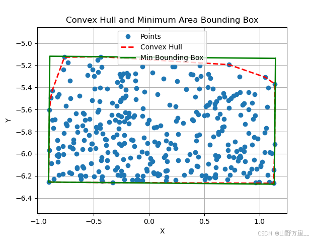
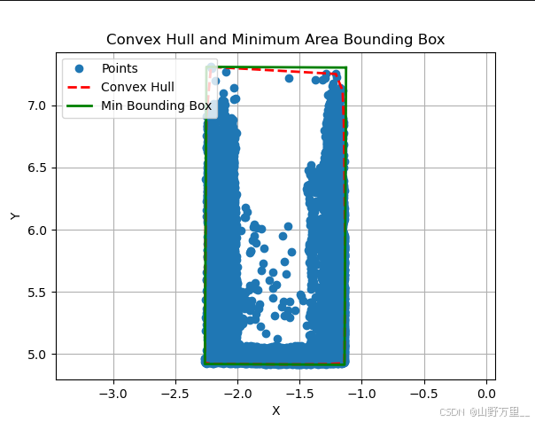
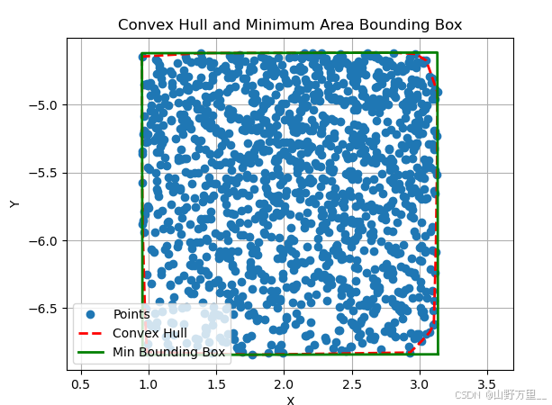

# Key steps
## Convex Hull computation: 
The qhull2D method is used to compute the convex hull of the input point set. 
This step ensures that we find the outer boundary of the point set as a candidate boundary for the minimum rectangle.
## Minimum Rectangle calculation: 
The minBoundingRect algorithm is used to calculate the minimum directed bounding box. The algorithm returns the width, height, corner coordinates, 
and area of the rectangle.
# Displaying the results

